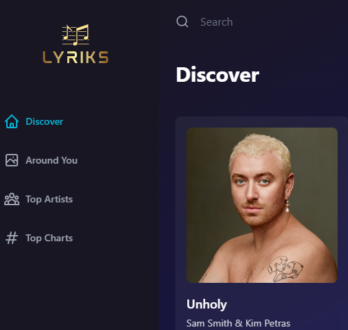

# Built and Deployed Music App kind of spotify with React (Tailwind, Shazam, Redux)-(Full Front-End)
 

## For use only:
# only do npm run Dev
# and go to the link deployed on screen
# Or easier
# the page is allready deployed at:
# https://lyriks-music-player-app.netlify.app/ 
## and you do not need to install any thing!

